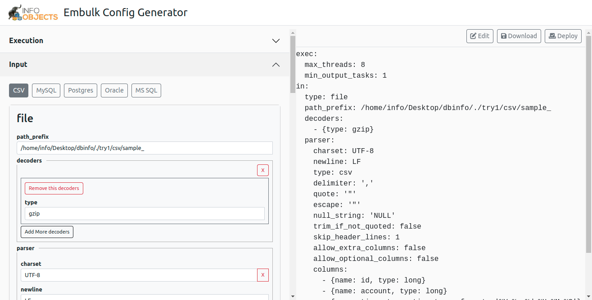
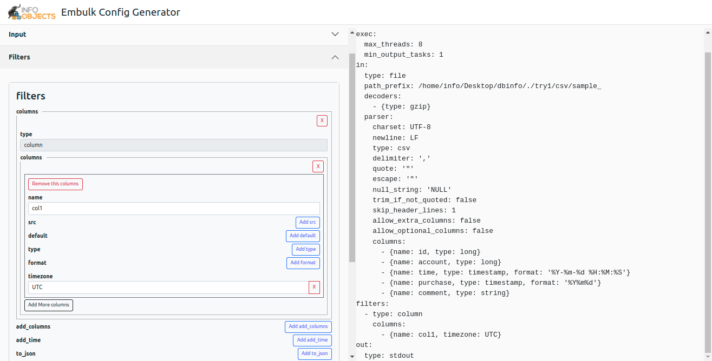
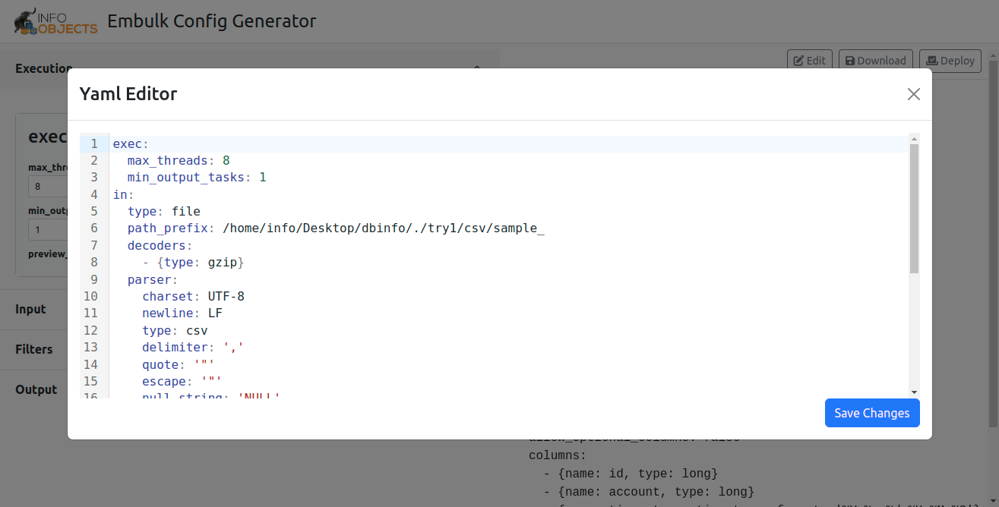

<p align="center">
  <a href="https://www.infoobjects.com/" target="blank"></a>
</p>
<p align="center">Infoobjects is a consulting company that helps enterprises transform how and where they run applications and infrastructure.</p>

## Embulk yaml config generator

[](LICENSE)

Embulk yaml config generator will help you to generate Embulk yaml code from UI. It has simple ui inertface where from you can choose plugin options(CSV, MySql, Postgres, Jdbc, sqlserver, etc) to genrate yaml code. This application has been built with NestJs(back-end) and NextJs(front-end).



## Quick start

back-end setup

```bash
cd back-end
npm install
npm run start
```
fornt-end setup
```bash
cd fornt-end
npm install
npm run dev
```

## Back-end Configuration

Change default port number 
```bash
//Goto file location /back-end/src/main.ts and find the line
await app.listen(3200); 
//in bootstrap function you can change nestJs port number from here.
```
whitelist url's 
```bash
//There maybe CORS issue when you use server api on front-end app.
//Goto file location /back-end/src/main.ts and find the line 
const whitelist = ['http://localhost:3000', 'http://localhost:3200'];
//in bootstrap function, from here you update the domain name to avoid CORS issue.
```


## Front-end Configuration

Change default api endpoint 
```bash
//Goto file location /front-end/utils/api.ts and find the line 
const endpoint = "http://localhost:3200/";
//and from here you can change api endpoint.
```
## Screenshots






## Useful Links

- [NestJs](https://nestjs.com)
- [NodeJs](https://nodejs.org)
- [NextJs](https://nextjs.org)
- [ReactJs](https://reactjs.org)
- [React Bootstrap](https://react-bootstrap.github.io)
- [Embulk](https://www.embulk.org)

## Licensing

InfoObjects [license](LICENSE) (MIT License)